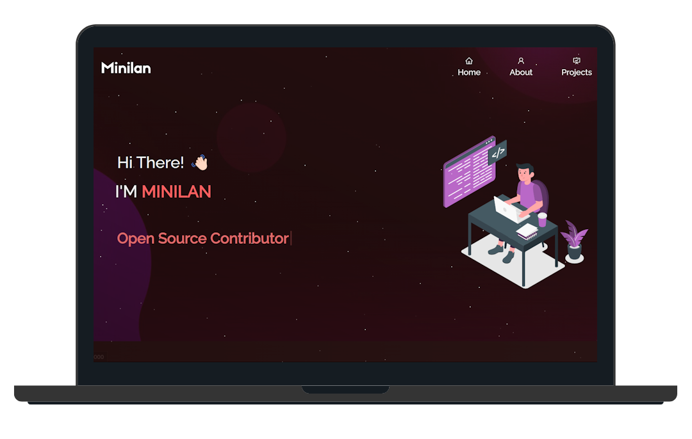

<h2 align="center">
  Minilan's Portfolio Website 
  <a href="https://minilan.fr/" target="_blank">minilan.fr</a>
</h2>

  

 

 &nbsp;
 &nbsp;
 &nbsp;
 &nbsp;

## Built With

This is my personal portfolio website <a href="https://minilan.fr/" target="_blank">minilan.fr</a>, showcasing my projects, skills, and resume 

Technologies used to build this project:

- React.js  
- Bootstrap  
- CSS3  
- Visual Studio Code  

## Features

**📖 Multi-Page Layout**

**🎨 Styled with React-Bootstrap and customizable colors**

**📱 Fully Responsive Design**
